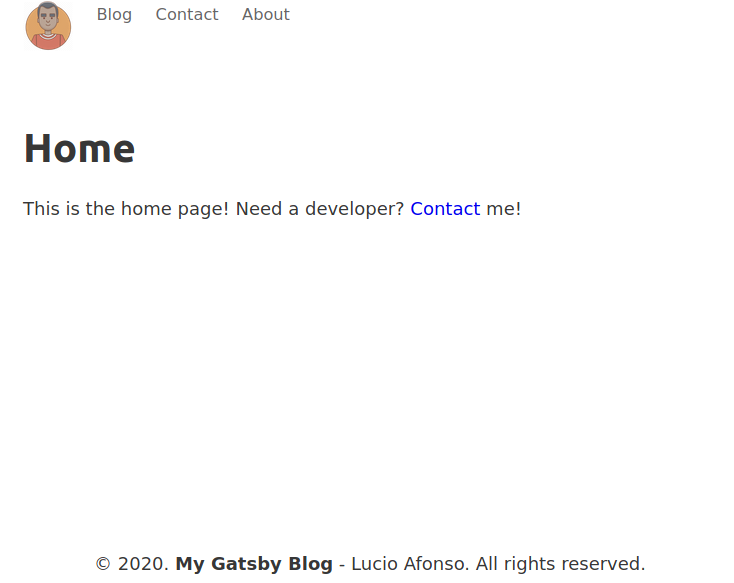

[](https://app.netlify.com/sites/my-gatsby-blog-2020/deploys)

# gatsby_blog

This is my new blog. <br />
Currently live at: https://my-gatsby-blog-2020.netlify.app <br />

**Tech to be used**: GatsbyJS, graphql, scss...



## Getting Started

This program was created under Linux Ubuntu 20.04 (x64) Operative System using GatsbyJS 2.24.14, <br />
NodeJS 12.16.3 and npm 6.14.4.

## Prerequisites

In order to use this program it is highly necessary to have an **_internet connection_** and install <br /> NodeJS v12.16+ (includes npm v6.14+).

i) Installing NodeJS v12.16+ <br />
It is possible that NodeJS has been already installed, to check use the following code in the command line:

```
  $ node --version
  [v12.16.3]
```

If errors occured or NodeJS has not yet been installed please visit their<br />
website http://nodejs.org/en/download/ and follow the instructions there.

ii) Installing npm v6.14+<br />
npm comes bundled with a successful NodeJS installation,<br />
to check use the following code in the command line:

```
  $ npm --version
  [v6.14.4]
```

## Deployment

Please link all npm dependencies:

```
  ~/gatsby_blog> npm i
  [*installation warnings*]

  [X packages are looking for funding]
```

In order to start the GatsbyJS server, execute:

```
  ~/gatsby_blog> npm start
  [...]
  [success Building development bundle - 4.605s]
```

Then opening the (default) website on **Mozilla Firefox**(\*):

[localhost:8000](http://localhost:8000)

## Versioning

Version 1.1 - Current version

## Author

Lucio Afonso

## License

This project is licensed under the GPL License - see the LICENSE.md file for details

## Acknowledgments

Official sites:<br />
http://gatsbyjs.org/<br />
http://nodejs.org/<br />

Tutorials:<br />
[Andrew Mead](https://youtu.be/8t0vNu2fCCM)
